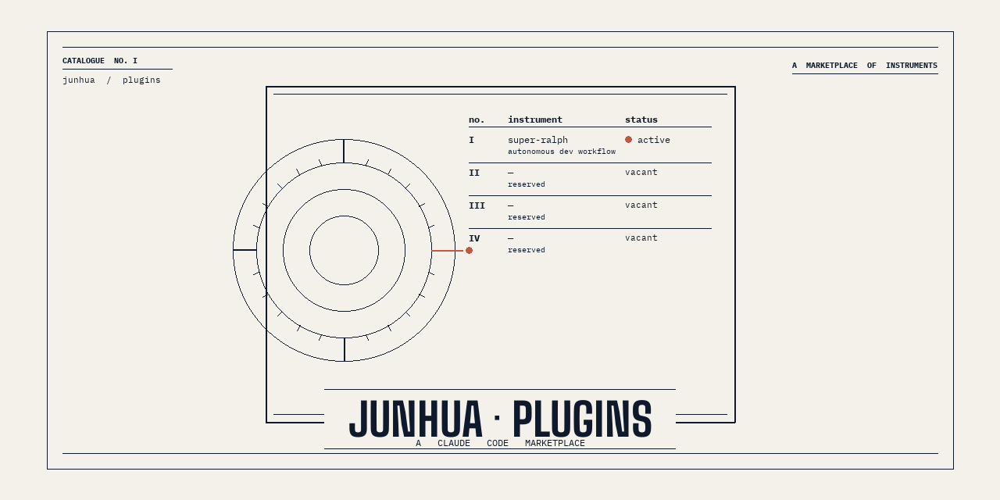

<p align="center">
  
</p>

# junhua-plugins

A Claude Code marketplace hosting plugins by [@junhua](https://github.com/junhua).

## Install

```
/plugin marketplace add junhua/claude-plugins
/plugin install super-ralph@junhua-plugins
```

## Plugins

### super-ralph

Design-first autonomous development workflow.

- `/super-ralph:design` produces implementation-ready epics with `[STORY]` + `[BE]` + `[FE]` + `[INT]` sub-issues, full Gherkin AC (≥3 scenarios including `[SECURITY]`), Shared Contracts, and exact TDD tasks that the build phase copies verbatim.
- **`--local` mode** (v0.11.0) writes the entire epic + all stories into a single `docs/epics/<slug>.md` file and skips GitHub issue creation — useful for iterative design, spikes, and internal work.
- **`/super-ralph:improve-design "<prompt>"`** (v0.11.0) takes a single natural-language prompt, autonomously resolves the target epic (local or GitHub), interprets feedback into structured changes, applies conservative edits, and re-validates. Shipped stories are immutable.
- `/build-story`, `/e2e`, `/review-design`, `/build` auto-detect local vs GitHub from the argument shape (`docs/epics/<slug>.md#story-N` vs `#123`).
- Fire-and-forget pipelines: build → review-fix → verify → finalise → release. Domain-aware repair with hotfix flow.

- Source: [junhua/super-ralph](https://github.com/junhua/super-ralph)
- Category: development

## About

This marketplace is a thin pointer layer. Each plugin lives in its own GitHub repository so it can be versioned, tagged, and installed independently. The `.claude-plugin/marketplace.json` file is the manifest Claude Code reads when you run `/plugin marketplace add`.

## License

MIT
