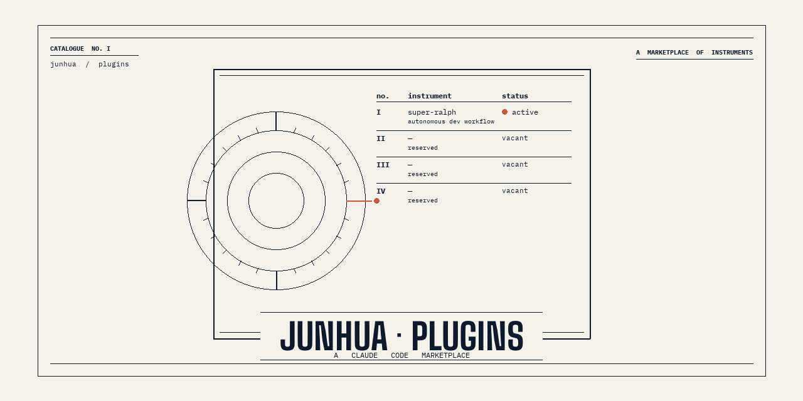

<p align="center">
  
</p>

# junhua-plugins

A Claude Code marketplace hosting plugins by [@junhua](https://github.com/junhua).

## Install

```
/plugin marketplace add junhua/claude-plugins
/plugin install super-ralph@junhua-plugins
/plugin install forth-ai-harness@junhua-plugins
```

## Plugins

### super-ralph

Design-first autonomous development workflow.

- `/super-ralph:design` produces implementation-ready epics with `[STORY]` + `[BE]` + `[FE]` + `[INT]` sub-issues, full Gherkin AC (≥3 scenarios including `[SECURITY]`), Shared Contracts, and exact TDD tasks that the build phase copies verbatim.
- **`--local` mode** (v0.11.0) writes the entire epic + all stories into a single `docs/epics/<slug>.md` file and skips GitHub issue creation — useful for iterative design, spikes, and internal work.
- **`/super-ralph:improve-design "<prompt>"`** (v0.11.0) takes a single natural-language prompt, autonomously resolves the target epic (local or GitHub), interprets feedback into structured changes, applies conservative edits, and re-validates. Shipped stories are immutable.
- `/build-story`, `/e2e`, `/review-design`, `/build` auto-detect local vs GitHub from the argument shape (`docs/epics/<slug>.md#story-N` vs `#123`).
- Fire-and-forget pipelines: build → review-fix → verify → finalise → release. Domain-aware repair with hotfix flow.

- Source: [junhua/super-ralph](https://github.com/junhua/super-ralph)
- Category: development

### forth-ai-harness

Technical-cofounder-in-a-plugin. Twelve slash commands take a rough idea from "I want a thing that does X" to a merged, deployed, polished product — and the plugin learns from every shipped task to improve itself.

- Pipeline: `/finit` (one-time per project) → `/fbrainstorm` → `/fspec` → `/fdesign` → `/fbuild` → `/fpolish` → `/ftest` → `/ffix` → `/flaunch`. Plus `/fretro`, `/fdream`, `/fhelp`. Run `/fhelp` after install for a plain-English guide to all 12 commands.
- Every command is a **convergence loop with polish-exhaustion enforced**. Each iteration must list 3 polish-could-be-better items and decide fix-now / defer-to-NEXT.md / accept-with-reason before declaring converged. Never fakes success.
- **Dual-AI mode (optional).** Pass `--codex` to any command for a Claude + Codex collaboration: Claude moves fast, Codex (slow + careful) does the second pass. Read-only phases run Codex in parallel; write phases isolate Codex in a worktree; `/flaunch` runs Codex synchronously as the final pre-merge audit. Works in **Claude-only mode** if Codex isn't installed — `/finit` detects your environment and configures the right mode.
- **Cross-project memory layer (v0.2.0+).** Each `/flaunch` writes a per-task `summary.json` to `~/.claude/forth-ai-harness-memory/` and auto-syncs to a private central repo. `/fretro` distills patterns across all your projects; `/fdream` reads those patterns and proposes plugin improvements with semver-correct version bumps (and with `--apply` commits them). Three-layer redaction prevents secrets from ever leaving your machine.
- **Spec-driven, behavior-driven, subagent-driven.** No code is written until `/fspec` checks a Gherkin AC + NFR + invariants spec into Linear. Gherkin compiles 1:1 to deterministic Playwright tests. Every phase fans out to fresh-context subagents. Linear is the single source of truth; artifacts are AI-readable markdown with YAML frontmatter and stable semantic tags.
- **Gated launch.** 7 hard gates (authorship, Linear contract, protected-branch, CI green, working-tree clean, Codex audit, optional human-approval label) must all pass before `/flaunch` merges.

After install, run `/finit` once per repo to detect your environment (Codex, bun, gh, Linear MCP) and write per-project config to `.claude/forth-ai-harness.config.json`.

- Source: [Forth-AI/forthai-harness](https://github.com/Forth-AI/forthai-harness)
- Category: development

## About

This marketplace is a thin pointer layer. Each plugin lives in its own GitHub repository so it can be versioned, tagged, and installed independently. The `.claude-plugin/marketplace.json` file is the manifest Claude Code reads when you run `/plugin marketplace add`.

## License

MIT
